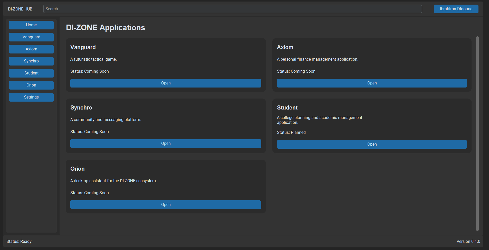

# DI-ZONE Hub

DI-ZONE Hub is a modular Python desktop application designed to centralize and launch the applications in the DI-ZONE ecosystem from a single interface.

Instead of having each DI-ZONE application operate as an unrelated desktop program, the Hub provides one central dashboard where applications can be accessed and managed.

## Preview



## Current Version

**Version 0.1.0 - Early Development**

The first functional version includes:

- Sidebar navigation
- Application launcher cards
- Profile management
- Configurable application themes
- JSON-based data storage
- Modular Python architecture
- Separate application and navigation components

## Technologies

- Python
- CustomTkinter
- JSON

## Development Tools

- Visual Studio Code
- Git / GitHub
- Windows
- Ubuntu / WSL

Development is primarily performed on Windows, with Linux and Ubuntu/WSL also being used for learning and development.

## Project Structure

The project is organized into multiple directories to separate application logic, assets, configuration, testing, and development resources.

```text
DI-ZONE HUB/
├── assets/
├── backups/
├── database/
├── docs/
├── logs/
├── modules/
├── sounds/
├── src/
├── tests/
├── README.md
└── settings.json
```

## What I Learned

Building DI-ZONE Hub has helped me develop experience with:

- GUI layout and widget positioning
- Row and column configuration
- Modular Python application structure
- Imports and module organization
- JSON data storage
- Debugging syntax and runtime errors
- Reading terminal error messages
- Isolating faulty components before testing corrections
- Git and GitHub workflows

## DI-ZONE Ecosystem

DI-ZONE Hub is intended to serve as the central launcher for multiple DI-ZONE projects.

One project currently under development is **DI-ZONE Student**, an academic management application designed to help students organize coursework and monitor academic progress.

Additional DI-ZONE applications are planned for future development.

## Status

**Version:** Early Development

The current version is functional but is still actively being developed and reorganized.

Future development may include improved application launching, interface improvements, additional customization, expanded profile management, and integration with other DI-ZONE applications.

## Author

**Ibrahima Diaoune**

Computer Science student at Georgia State University – Perimeter College.
